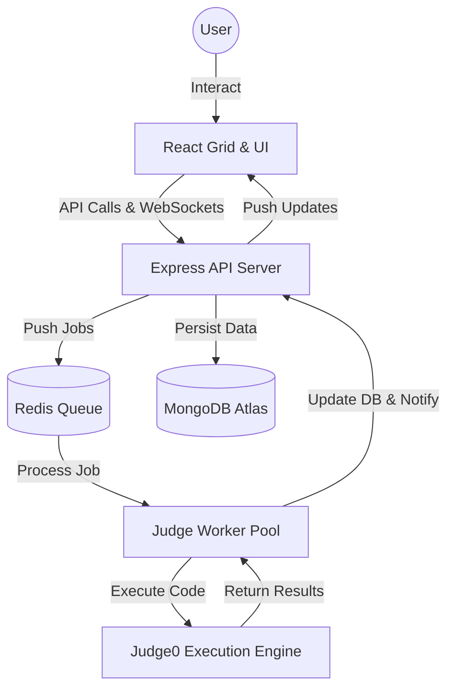

# 🚀 CodeArena - The Ultimate Platform for Mastering Algorithmic Excellence

<p align="center">
  
</p>

<p align="center">
  <strong>The Ultimate Platform for Mastering Algorithmic Excellence</strong>
</p>

<p align="center">
  <a href="#-key-features">Features</a> •
  <a href="#-system-architecture">Architecture</a> •
  <a href="#-tech-stack">Tech Stack</a> •
  <a href="#-getting-started">Getting Started</a> •
  <a href="#-contributing">Contributing</a>
</p>

---

[](https://reactjs.org/)
[](https://nodejs.org/)
[](https://www.mongodb.com/)
[](https://tailwindcss.com/)
[](https://www.docker.com/)

> [!IMPORTANT]
> **CodeArena** is a high-performance, premium coding platform designed for developers to sharpen their algorithmic skills, compete in real-time contests, and track their growth with advanced analytics.

---

## 📸 Product Showcases

|                                    Problem List                                    |                                   Leaderboard                                   |
| :--------------------------------------------------------------------------------: | :-----------------------------------------------------------------------------: |
|  |  |

|                                 Analytics Dashboard                                  |                                    Contest View                                    |
| :----------------------------------------------------------------------------------: | :--------------------------------------------------------------------------------: |
|  |  |

---

## ✨ Key Features

### 🛠️ Developer Experience

- **Premium Monaco Editor**: A full-featured code editor with syntax highlighting, IntelliSense-like features, and multi-language support.
- **Real-time Execution**: Submit your code and get instant feedback with a scalable backend judge system.
- **Streak Tracking**: Stay motivated with daily streak counters and interactive heatmaps.

### 📊 Advanced Analytics

- **Glassmorphism Dashboard**: A stunning, modern UI for tracking your progress and metrics.
- **Performance Visualization**: Interactive charts (powered by Recharts) visualize your performance across different difficulty levels and categories.
- **Live Leaderboard**: Real-time contest rankings using Socket.IO for immediate feedback.

### ⚡ Impact Features

- **Scalable Judge System**: Uses BullMQ and Redis for efficient, asynchronous code execution.
- **Social Integration**: Follow other developers, share insights, and discuss problems in dedicated threads.
- **Virtual Contests**: Participate in past contests at any time with virtual ranking support.

---

## 🏗️ System Architecture



---

## 🛠️ Tech Stack

### Frontend

- **Framework**: `React 19` with `Vite`
- **Styling**: `Tailwind CSS 4` & `Framer Motion` (Advanced Animations)
- **State**: `Zustand` (Lightweight Context Replacement)
- **UI Architecture**: `Shadcn UI` & `Lucide Icons`
- **Real-time**: `Socket.IO Client`

### Backend

- **Runtime**: `Node.js` & `Express 5`
- **Database**: `MongoDB` with `Mongoose 8`
- **Job Queue**: `BullMQ` & `Redis` (Reliable Task Processing)
- **Authentication**: `Passport.js` & `JWT` (Google OAuth 2.0 supported)
- **Monitoring**: `Winston Logger`

---

## 🚀 Getting Started

### Prerequisites

- [Node.js](https://nodejs.org/) (v18+)
- [Docker](https://www.docker.com/) & [Docker Compose](https://docs.docker.com/compose/)
- [MongoDB](https://www.mongodb.com/) (Local or Atlas)
- [Redis](https://redis.io/) (Required for background jobs)

### Local Development

1. **Clone the Repository**

   ```bash
   git clone https://github.com/ajeetk7ev/CodeArena.git
   cd CodeArena
   ```

2. **Environment Setup**
   - Create `.env` files in both `backend` and `frontend` directories based on the provided examples.

3. **Install Dependencies**

   ```bash
   # Install Backend and Frontend deps
   cd backend && npm install && cd ../frontend && npm install
   ```

4. **Run Locally**
   ```bash
   # Start everything using Docker
   docker-compose up --build
   ```
   _Alternatively, run `npm run dev` in both `backend` and `frontend` folders._

---

## 🤝 Contributing

We welcome contributions! Please check our [CONTRIBUTING.md](./CONTRIBUTING.md) for guidelines.

---

## 📄 License

This project is licensed under the MIT License - see the [LICENSE](LICENSE) file for details.

---

<p align="center">
  Built with ☕ and passion by the <strong>CodeArena Team</strong>
</p>
